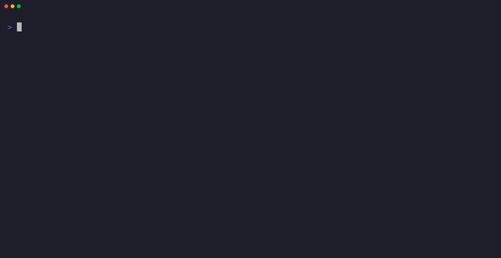

# torque

<p align="center">
  <a href="https://ingresslabs.net">IngressLabs</a> |
  <a href="https://ingresslabs.github.io/torque/">Docs</a> |
  <a href="https://github.com/ingresslabs/torque/actions/workflows/ci.yml">CI</a> |
  <a href="https://github.com/ingresslabs/torque/releases">Releases</a> |
  <a href="./LICENSE">License</a>
</p>

Agent-first Kubernetes delivery CLI.

`torque` is one file-first loop for Kubernetes delivery: build, verify, plan,
apply, capture evidence, and inspect what happened. Captures, verifier reports,
and chart archives are portable SQLite artifacts for CI, review, and later
debugging without a running service.

## Demos

<details open>
<summary>Build, plan, apply, and logs</summary>
<p align="center"><kbd></kbd></p>
</details>

<details open>
<summary>Security and evidence gates</summary>
<p align="center"><kbd></kbd></p>
</details>

<details open>
<summary>Verifier report</summary>
<p align="center"><kbd></kbd></p>
</details>

<details open>
<summary>torque compared with split tooling</summary>
<p align="center"><kbd></kbd></p>
</details>

## Quick Start

```bash
torque build . --tag ghcr.io/acme/api:dev --capture ./build.sqlite
torque apply plan --chart ./chart --release api -n prod \
  --build-capture ./build.sqlite --github-comment --output plan.md
torque apply --chart ./chart --release api -n prod --capture ./apply.sqlite --yes
torque logs 'api-.*' -n prod --capture ./logs.sqlite --tail 100
```

Build, review, apply, and capture logs in one loop.

## Common Recipes

### Verified Release

```bash
torque build . --tag ghcr.io/acme/api:dev --capture ./build.sqlite
verifier --chart ./chart --release api -n prod --format json --report verify.json
torque apply plan --chart ./chart --release api -n prod \
  --verify-report verify.json --build-capture ./build.sqlite \
  --github-comment --output plan.md
torque apply --chart ./chart --release api -n prod \
  --require-verified verify.json --capture ./apply.sqlite --yes
```

### Dependency Stack

```bash
torque stack plan --config ./stacks/prod --bundle ./stack-plan.tgz
torque stack apply --config ./stacks/prod --yes --capture ./stack.sqlite
torque stack status --config ./stacks/prod --follow
```

## Features

- Golden deploy workflow with one trusted loop.
- Self-contained SQLite evidence for builds, deploys, logs, stacks, and chart archives.
- Reviewable Helm plans, diffs, Markdown, and visual artifacts.
- Agent automation through `torque-agent` gRPC workflows.
- BuildKit, SBOM/provenance, verifier reports, and policy checks.

## Utilities

- `verifier` is the standalone Kubernetes configuration verifier included in this repo. It checks Helm charts, rendered manifests, and live namespaces with the same policy engine used by `torque` verification workflows, producing reports suitable for local review and CI.

## Install

Requires Go 1.25.9+.

```bash
go install github.com/ingresslabs/torque/cmd/torque@latest
go install github.com/ingresslabs/torque/cmd/verifier@latest
```

From a checkout:

```bash
make build
./bin/torque --help
```
