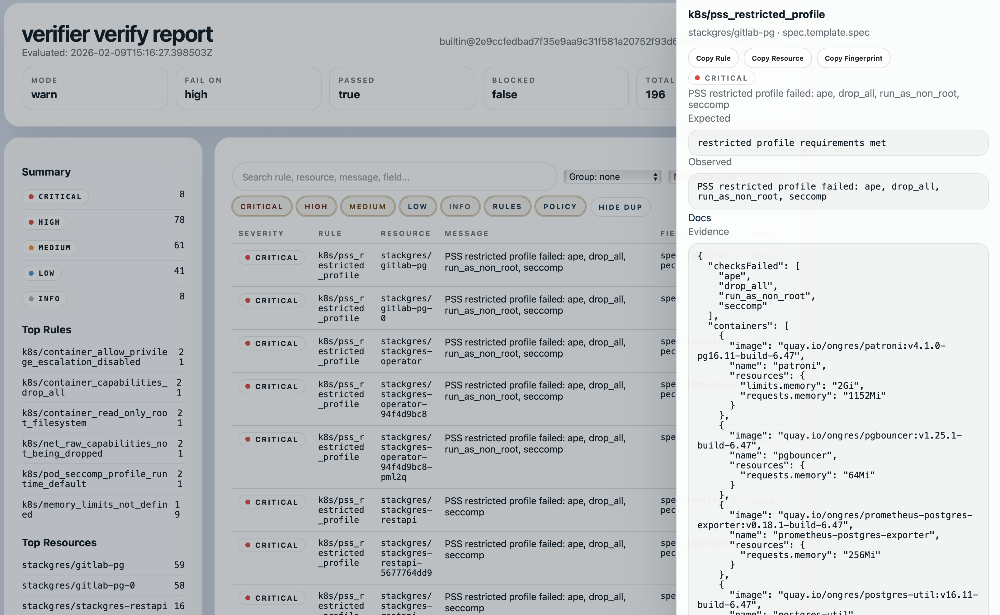

# Verifier

Verifier is the standalone Kubernetes policy verifier included with torque. It checks Helm charts, rendered manifests, and live namespaces with the shared torque verification engine.

## Quick Start

```bash
go install ./cmd/verifier

verifier --chart ./chart --release my-app -n default
verifier --manifest ./rendered.yaml
verifier --namespace default --context my-context
```

## Reports And Baselines

```bash
verifier --manifest ./rendered.yaml --format html --report ./verify-report.html --open
verifier verify.yaml --baseline ./baseline.json
verifier verify.yaml --compare-to ./baseline.json
verifier rules list
```

The older `verify` binary remains available for existing CI scripts, but new docs and examples use `verifier`.

For the next-generation security direction, see
[Evidence-First Secrets And Verifier Spec](secrets-verifier-evidence-spec.md).


